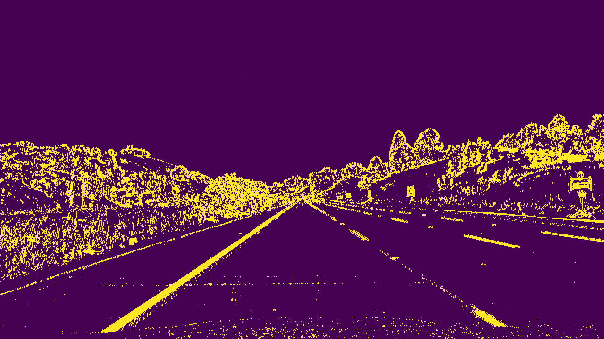
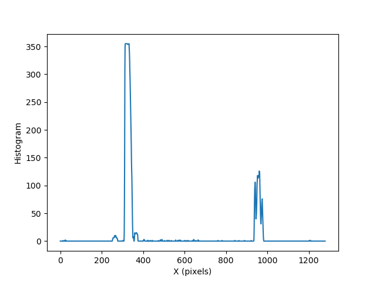
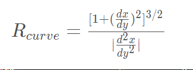
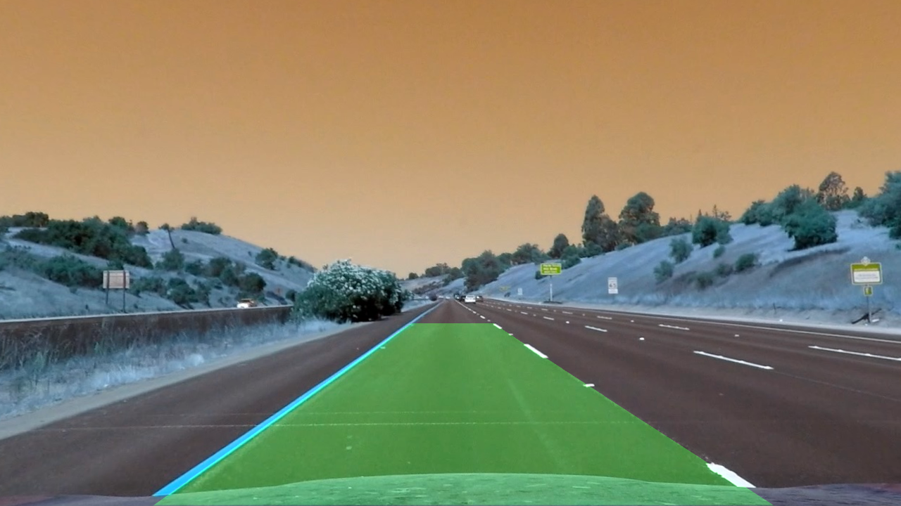

**Advanced Lane Finding Project**

The goals / steps of this project are the following:

* Compute the camera calibration matrix and distortion coefficients given a set of chessboard images.
* Apply a distortion correction to raw images.
* Use color transforms, gradients, etc., to create a thresholded binary image.
* Apply a perspective transform to rectify binary image ("birds-eye view").
* Detect lane pixels and fit to find the lane boundary.
* (To optimize: Only for videos after analyzing the first image) Detect lane pixels around the detected line of the previous image. 
* Determine the curvature of the lane and vehicle position with respect to the center.
* Warp the detected lane boundaries back onto the original image.
* Output visual display of the lane boundaries and numerical estimation of lane curvature and vehicle position.


[video1]: ./project_video.mp4 "Video"


---
### Camera Calibration

#### 1. Computation of the camera matrix and distortion coefficients with an example of a distortion corrected calibration image.

The code for this step is called `Camera_calibration.py`.  

I start by preparing "object points", which will be the (x, y, z) coordinates of the chessboard corners in the world. 
Here I am assuming the chessboard is fixed on the (x, y) plane at z=0, such that the object points are the same for each calibration image. 
Thus, `objp` is just a replicated array of coordinates, and `objpoints` will be appended with a copy of it every time I successfully detect all chessboard corners in a test image.  
`imgpoints` will be appended with the (x, y) pixel position of each of the corners in the image plane with each successful chessboard detection.  

I then used the output `objpoints` and `imgpoints` to compute the camera calibration and distortion coefficients using the `cv2.calibrateCamera()` function. 
I also save these two matrixes using `np.savez` such that I can use them later. 
Then, I applied this distortion correction to the test image using the `cv2.undistort()` function and obtained this result:

[image0]: ./camera_cal/test_image.jpg "distorted"
[image1]: ./output_images/for_readme/chessboard_undistorted.png "Undistorted_board"

Original image             |  undistorted image
:-------------------------:|:-------------------------:
![alt text][image0]  |  ![alt text][image1] 

### Pipeline (single images)

The code for this step is called `Line_detection_advanced.py`.  
Initially, it loads `mtx`, and `dist` matrices from the camera calibration step.

#### 1. Apply a distortion correction to raw images.

Using the saved `mtx`, `dist` from calibration, I have undistorted an image from a road:

[image10]: ./test_images/straight_lines1.jpg 
[image11]: ./output_images/for_readme/road_undistorted.png 

Original image             |  undistorted image
:-------------------------:|:-------------------------:
![alt text][image10]  |  ![alt text][image11]


#### 2. Create a thresholded binary image using color transforms and gradients.

(TODO: Which line of code?)

I used a combination of color and gradient thresholds to generate a binary image (thresholding steps at lines 30 through 53 in `Line_detection_advanced.py`). 

For gradient thresholds, the code includes a function called `grad_thresh`. 
First, I converted the image into grayscale `cv2.cvtColor(img, cv2.COLOR_BGR2GRAY)`. Note that if you are using `cv2.imread`, you should use `cv2.COLOR_BGR2GRAY`. 
But is you are using `matplotlib.image.imread`, you should use `cv2.COLOR_BGR2GRAY`. 
Then, I took the derivative in the x direction, using `cv2.Sobel` (Why? Because vertical lines can be detected better using gradient in the horizontal direction). 
Then, I scaled its magnitude into 8bit `255*np.absolute(sobelx)/np.max(abs_sobelx)`, and conervetd to `np.unit8`. 
In the end, to generate the binary mage, I used `np.zeros_like`, and applied the threshold.

For color threshhold, the code includes a function called `color_thresh`. I used HLS colorspace using `cv2.cvtColor(img, cv2.COLOR_BGR2HLS)`. 
(Why? because yellow and white colors can be detected well in S space). 
Then, I created the binary image `np.zeros_like`, and applied the threshold on the S channel. Also, I have applied threshhold on R space in RGB colorspace. The results are as follwos:

[image20]: ./output_images/for_readme/sx_binary.png 
[image21]: ./output_images/for_readme/s_binary.png 
[image22]: ./output_images/for_readme/R_binary.png 

Gradient threshhold           |  S threshhold (HSV) |  R threshhold from (RGB)
:-------------------------:|:-------------------------:|:-------------------------:
![alt text][image20]  |  ![alt text][image21] | ![alt text][image22]


In the end, I have combined the two binary thresholds, and here is an example of my output for this step.

<p align="center">  </p>

#### 3. Perform a perspective transform.

The code for my perspective transform includes a function called `warp()`, which appears in lines 55 through 68 in the file `Line_detection_advanced.py`. 
The `warp()` function takes as inputs an image (`img`), as well as source (`src`) and destination (`dst`) points. 
I chose the hardcode the source and destination points in the following manner:

```python
src = np.float32(
    [[(img_size[0] / 2) - 55, img_size[1] / 2 + 100],
    [((img_size[0] / 6) - 10), img_size[1]],
    [(img_size[0] * 5 / 6) + 60, img_size[1]],
    [(img_size[0] / 2 + 55), img_size[1] / 2 + 100]])
dst = np.float32(
    [[(img_size[0] / 4), 0],
    [(img_size[0] / 4), img_size[1]],
    [(img_size[0] * 3 / 4), img_size[1]],
    [(img_size[0] * 3 / 4), 0]])
```

This resulted in the following source and destination points:

| Source        | Destination   |
|:-------------:|:-------------:|
| 585, 460      | 320, 0        |
| 203, 720      | 320, 720      |
| 1127, 720     | 960, 720      |
| 695, 460      | 960, 0        |

I verified that my perspective transform was working as expected by drawing the `src` and `dst` points onto a test image and its warped counterpart to verify that the lines appear parallel in the warped image.

[image4]: ./output_images/for_readme/road_rectangale.png 
[image5]: ./output_images/for_readme/road_rectangale_warped.png 

Original image             |  undistorted image
:-------------------------:|:-------------------------:
![alt text][image4]  |  ![alt text][image5] 


#### 4.1 Identify lane-line pixels and fit their positions with a polynomial
To find lane pixels, a function called `find_lane_pixels()` is defined. 
First, the histogram of the bottom half of the image along the vertical axis is computed using `npsum`. 

<p align="center">  </p>

Then the peaks in the left half side and right half side of the histogram are computed as the initial estimate of the left and right lines respectively.
Then, the number of sliding windows `nwindows` and horizontal margin `margin` and the minimum number of pixels `minpix` are specified.

Then to recognize the left and right lines pixel positions, I defined a `for` loop.
To optimize the search process, at every iteration, the horizontal position of the center of the left and right windows is passed to the next iteration to fid the boundaries of the next window.
I start processing the bottom windows. 
The vertices of each left and right windows are computed. The indices of nonzero pixels in x and y directions within the windows are identified. 
To visualize this step, the left and right rectangles are plotted on the image using `cv2.rectangle` by specifying two opposite vertices of a rectangle.
I append indices to the main lists of indices, using `np.append`. 
If the minimum number of recognized indices in the left and right lists are more than `minpix`, I update the position of the center of the left and right windows.
I continue to process the next window which is the window above the bottom window. I continue processing each window to reach the `nwindows`.

After the loop ends, I concatenate the arrays of indices (previously was a list of lists of pixels), using `np.concatenate`. 
Finally, I extract the left and right line pixel positions as the output of `find_lane_pixels()` function.

The next step is to fit a 2nd order polynomial using `fit = np.polyfit` to the output of the previous function `find_lane_pixels`. 
To do this, I defined a function called `fit_polynomial()`.
To draw polynomials on the image, first I generate x and y values for plotting, using `np.linspace`. 
Then I used `fit[0]*ploty**2 + fit[1]*ploty + fit[2]` to have all points on the line for left and right lines, seperately. 
To plot them on the image, I use `plt.plot`. Also, I visualize the whole left and right windows on the images.

The output of the last function is the following figure:


[image410]: ./output_images/for_readme/binary_warped_window_pixel_line.png 
[image411]: ./output_images/for_readme/road_window.png 


Binary image             |  Road image
:-------------------------:|:-------------------------:
![alt text][image410]  |  ![alt text][image411] 


#### 4.2  Detect lane pixels around the detected line. (To optimize: Only for videos after analyzng the first image) 

For analyzing videos, we can use the detected lane lines information from the previous image to speed the code.
To do this, I have defined a function called `search_around_poly`. 
The input is the polynomial coefficient of the previous image, and a margin to restrict the area around the line for a search.
(Why? Because the lane lines do not usually jump! )
The output for this section is as follows:


#### 5. Calculate the radius of curvature of the lane and the position of the vehicle with respect to center.

I have defined a function called `measure_curvature_real` to measure the radius of curvature in meters. 
The input to the function is the output of the `fit_polynomial()` function, explinaed in the previus section. The formula is given below:

<p align="left">  </p>

To calculate the position of the car with respect to the center of the lane, I have assumed that the camera is placed in the middle of the car. 
Then the position of the middle of the lane is calculated as the mean value of the detected left and right lines on the bottom of the image.
The center of the car or camera is calculated by the image size, using `image.shape[1]`.
Then the off-center pixel is the distance between these two numbers, which is then converted to meters.
These two numbers are plotted on the images using `cv2.putText`.

#### 6. Provide an example image of your result plotted back down onto the road such that the lane area is identified clearly.

I implemented this step in lines # through # in my code in `yet_another_file.py` in the function `map_lane()`.  
Here is an example of my result on a test image:

<p align="center">  </p>

---

### Pipeline (video)

#### 1. Provide a link to your final video output.  Your pipeline should perform reasonably well on the entire project video (wobbly lines are ok but no catastrophic failures that would cause the car to drive off the road!).

Here's a [link to my video result](./project_video.mp4)

---

### Discussion

#### 1. Briefly discuss any problems / issues you faced in your implementation of this project.  Where will your pipeline likely fail?  What could you do to make it more robust?

Here I'll talk about the approach I took, what techniques I used, what worked and why, where the pipeline might fail and how I might improve it if I were going to pursue this project further.  
